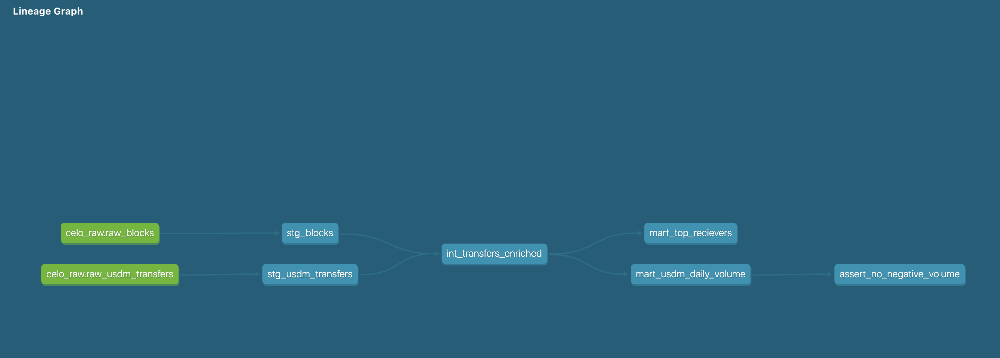

# Celo USDm Payments On-Chain Warehouse(with BigQuery)
 

Extracts Celo mainnet USDm stablecoin transfers via the Forno RPC,
lands them in BigQuery, and models them into tested analytical marts
with dbt (staging -> intermediate -> marts).
 
## Architecture
[ Forno RPC ] -> [ Python extractor ] -> [ BigQuery ]
   -> [ dbt: staging -> intermediate -> marts ] -> [ analytics ]
 
## Stack
Python 3.11, web3.py, google-cloud-bigquery, dbt-core 1.11,
dbt-bigquery, Pipenv
 
## Run it
1. brew install pipenv
2. pipenv install                       # rebuilds env from Pipfile.lock
3. cp .env.example .env                 # fill in your GCP project + key path
4. pipenv run python extract/extract_usdm.py 2000
5. cd celo_dbt && pipenv run dbt run && pipenv run dbt test
 
## Data model
- staging: typed, renamed source data
- intermediate: transfers enriched with block timestamps (incremental)
- marts: daily USDm volume; top receivers